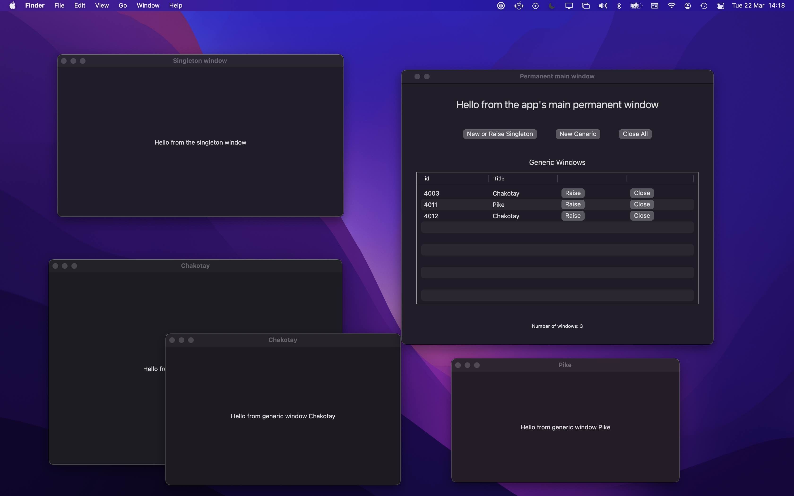

# macOS swiftuiWindowFun Readme

As of 2022/03 - SwiftUI's macOS built in Window management via the `WindowGroups` and `Scenes` mechanism is very limited. Many basic window 
operations on macOS are not available and require dropping to AppKit to achieve. 

This application demonstrates how this can be achieved.

## macOS window based operations demonstrated by the app

1. Creating and maintaining a single, unclosable main window.
    - Non-closable, ever present across restarts.
    - Restores on restart.
    - Close button removed from window chrome.
    - Menu close window items respond to window selection appropriately.

2. Singleton windows.
    - Closable.
    - Restore on restart if left open
    - Only ever a single instance.
    - If existing instance, attempts to create new then raises existing instead.
    - Menu items to create and close windows respond appropriately.

3. Generic window creation with remote raising and closing.
    - Closable
    - Instances restore on restart.
    - Windows given identifiable titles.
    - Menu items to create and close windows respond correctly.
    - If existing window has same title, then opening raises that instance rather than creating a new window.
     

4. App menu creation and entry validation along with keyboard shortcuts operates as would be expected for each window type.

5. App URI scheme and routing

    - Open or raise a singleton window - [swiftuiWindowFun://singleton](swiftuiWindowFun://singleton)
    - Open and route to a generic window - [swiftuiWindowFun://generic?title=Spock](swiftuiWindowFun://generic?title=Spock)

6. Maintaining a list of windows, programatic raising and closing as needed.

## Requirements 
This project has been built using Xcode 13.2 targeting macOS 12.1 Monterey and hand tested with version 12.3.  

It should build and run successfully on any **macOS 12. Monterey** installation.

## Approach

App attempts to use SwiftUI to maximum extent possible but goes under the covers to get hold of a 
`NSWindow` reference to enable it to add missing macOS standard control and customisation functionallity.

Specifically ...

- Uses openURL to spawn new windows in conjunction with `.handlesExternalEvents(preferring: allowing:)` where
necessary to provide singleton windows. Window opening and routing is done in `AppModel`.

- The underlying `AppKit NSWindow` is obtained by using SwiftUI's `NSViewRepresentable` to add a hidden diagnostic probe 
`NSView` to the  window's render tree and pull the information from the that. See `HostingWindowFinder` for 
implementation, and `PermanentView`, `SingletonView` and `GenericView` for how it has been incorporated.

- References to individual windows and control over what can be closed and post close cleaning operations is done 
via `NSWindow` delegation. See `AppModel` and its extension `NSWindow+NSWindowDelegate` for more on that. 

- Menu options are set out in `FileMenuCommands` which uses functionallity from `AppModel` to manage windows and control
 available menu options.

More details and notes in code.
